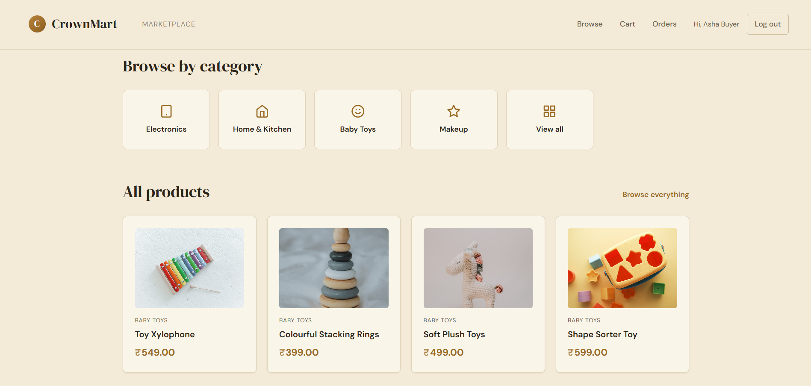
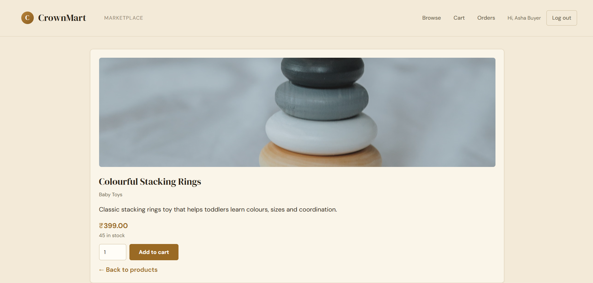
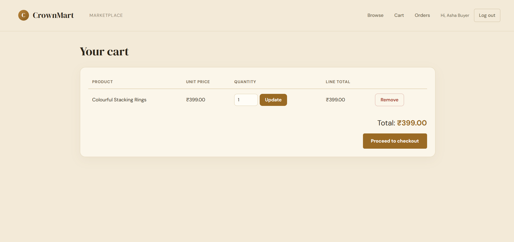
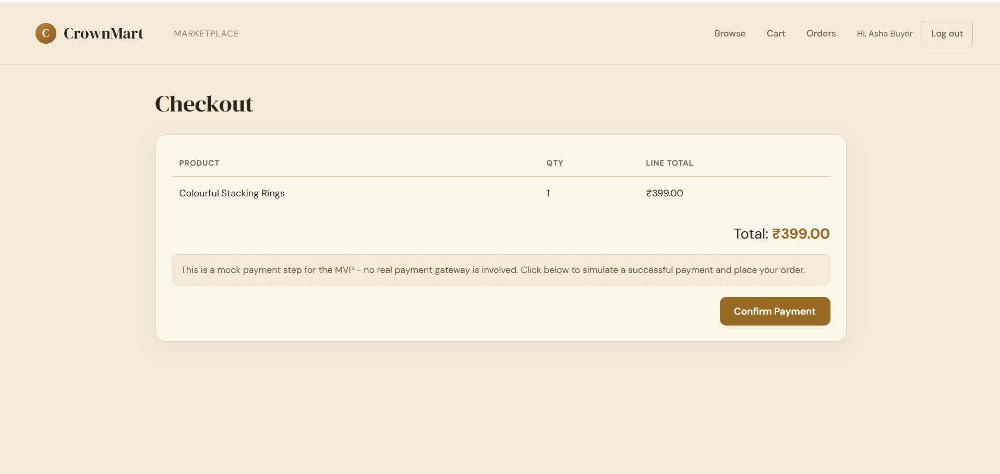
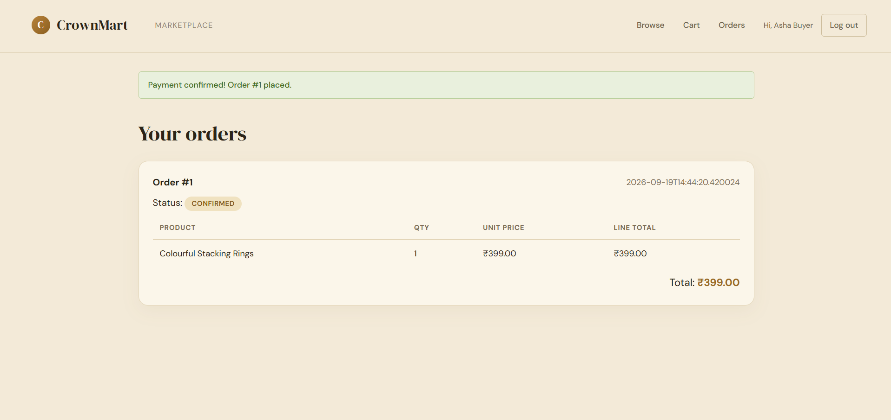
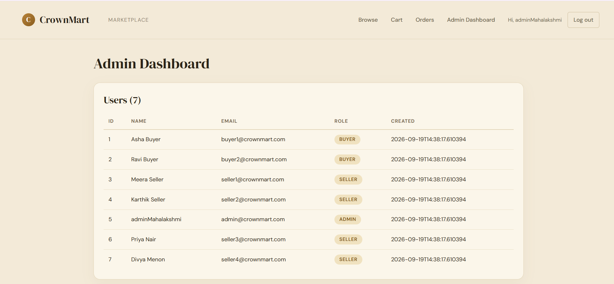
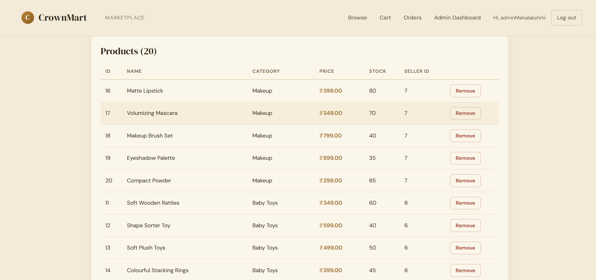

# CrownMart

A multi-seller online marketplace built with Java Servlets, JSP and JDBC. Independent sellers list products, buyers browse, add to cart and place orders, and an admin moderates the marketplace.

**Live demo:** https://crownmart.onrender.com
(Hosted on Render's free tier. The first request after a period of inactivity can take about 30 seconds to wake up.)

**Release:** [v1.0.0](https://github.com/mahalakshmisr301107-arch/CrownMart/releases/tag/v1.0.0) — Full Build + Deploy checkpoint

Anna University R2025, Semester 3 capstone project.

## Problem statement

Small independent sellers often have no simple, affordable place to list their goods, and buyers have no easy way to browse several sellers in one place. CrownMart provides one marketplace where sellers manage their own listings, buyers shop across sellers, and an admin keeps listings and users in check.

## Features

| Area | What it does |
|---|---|
| Accounts | Register as a buyer or seller, log in and log out, role-based access |
| Browsing | Home page with category tiles, full product list, category filter, product detail page |
| Seller tools | Create, edit and delete your own listings; view orders that contain your products |
| Cart and checkout | Add, update and remove cart items; mock payment step; order confirmation |
| Orders | Buyers see their order history with status and line items |
| Reviews | Buyers review products from completed orders |
| Admin | Dashboard listing users, products and orders; remove any listing |
| Errors | Custom 404 and 500 pages |

## Screenshots

| Home | Product |
|---|---|
|  |  |

| Cart | Checkout |
|---|---|
|  |  |

| Orders |
|---|
|  |

| Admin: users | Admin: products |
|---|---|
|  |  |

## Tech stack

| Layer | Technology |
|---|---|
| Language | Java 17 |
| Web | Servlets, JSP, JSTL (Tomcat 9) |
| Database | H2 with HikariCP connection pool |
| Security | jBCrypt password hashing, AuthFilter for role checks |
| Logging | SLF4J and Logback |
| Build | Maven |
| Tests | JUnit 5 (DAO and service layer) |
| CI/CD | GitHub Actions, Docker, Render |

## Architecture

The app follows a layered structure:

- **Controller** (servlets): handle HTTP requests and choose the view.
- **Service**: business rules such as placing an order or validating a review.
- **DAO** (JDBC): all database access, using `PreparedStatement` exclusively.
- **View** (JSP and JSTL): pages under `WEB-INF/views`, sharing a common header and footer.
- **Filter**: `AuthFilter` protects cart, checkout, orders, reviews, seller and admin routes by role.

Diagrams (ER, use case, sequence) are in [docs/DIAGRAMS.md](docs/DIAGRAMS.md).

## Database migrations

Schema changes are tracked as numbered, checked-in SQL files under [`db/migrations`](db/migrations), starting with `V1__init_schema.sql`. Live schema changes are not hand-edited directly.

## Run locally

Requirements: Java 17, Maven, Tomcat 9.

    mvn -B clean verify

This runs the tests and builds `target/crownmart.war`. Deploy that WAR to Tomcat 9 and open `http://localhost:8080/crownmart`.

## Health check

`GET /api/v1/health` returns `{"status":"UP","db":"UP"}` when the app and database connection are healthy. Used for uptime monitoring. Try it live: https://crownmart.onrender.com/api/v1/health

## Demo logins

All accounts use the password `crownmart123`.

| Role | Email |
|---|---|
| Buyer | buyer1@crownmart.com, buyer2@crownmart.com |
| Seller | seller1@crownmart.com, seller2@crownmart.com, seller3@crownmart.com, seller4@crownmart.com |
| Admin | admin@crownmart.com |

## Security notes

- Passwords are hashed with bcrypt, never stored in plain text.
- Role-based access is enforced server-side by `AuthFilter` on cart, checkout, orders, reviews, seller and admin routes.
- User-supplied values are escaped in JSP output with `<c:out>`.
- Credentials and config files (`*.properties`, `.env`) are excluded from version control.
- Custom 404 and 500 error pages, so stack traces are never exposed to the client.
- All SQL statements use `PreparedStatement`; no string-concatenated queries.

## Known limitations

- The database is H2 on Render's free tier, so data resets to the seed data when the service restarts.
- Payment is a mock step. No real payment gateway is connected.
- Test coverage includes DAO and service-layer unit tests (20 tests total). Servlet-level tests are not yet included.

## Project status

The full build and deploy checkpoint (Sep 21, 2026) is complete: all core features (F1–F8), live deployment, CI, security checklist, migrations, and design diagrams are in place. The AI chatbot is planned for the final review on Oct 10, 2026.