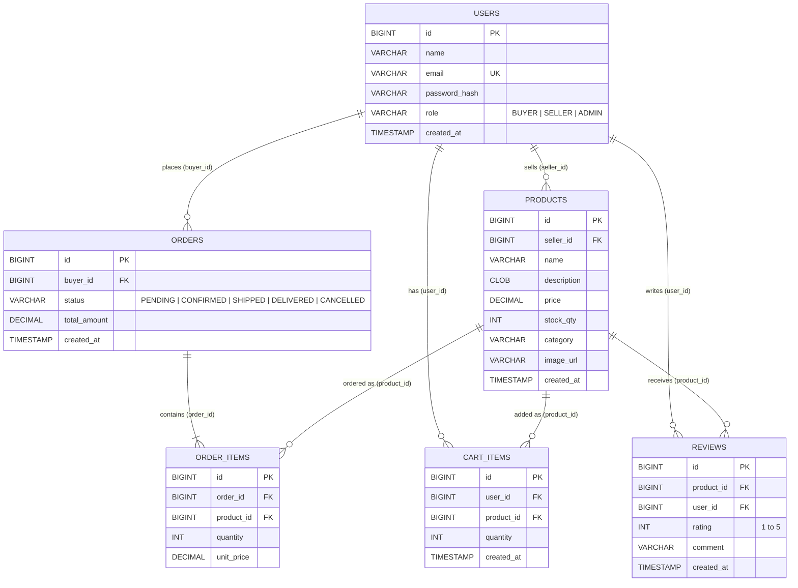
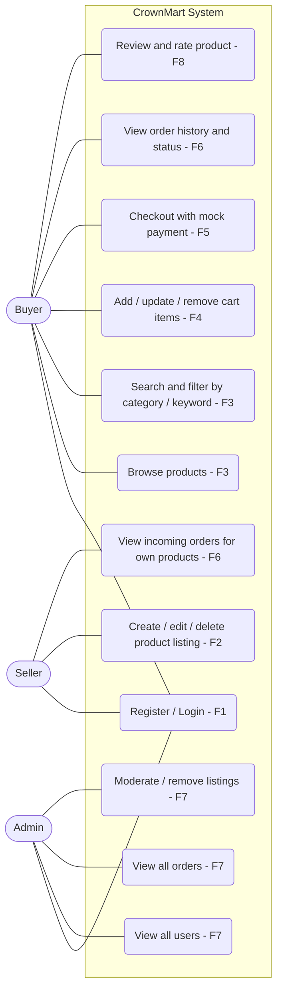
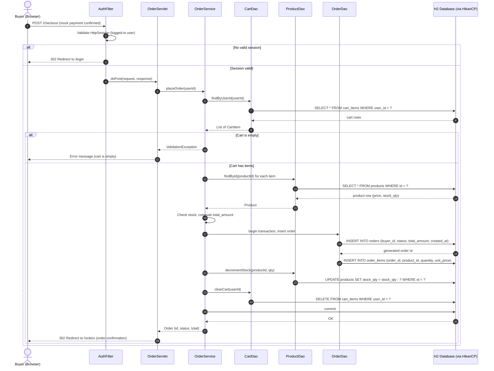

# CrownMart: Design Diagrams

Diagrams D1 to D3 required by the project specification (Section 5).

## D1. ER Diagram

Derived from `schema.sql`. All monetary fields are `DECIMAL(10,2)`, every foreign key is indexed, and `users.email` is unique.

## D2. Use Case Diagram

Actors and use cases map to feature requirements F1 to F8. The Admin account is created by seed data only (no signup flow).

## D3. Sequence Diagram: Place Order

Browser to Servlet to Service to DAO to Database, including the response path. The DAO layer gets connections from the HikariCP pool created by the `ServletContextListener`. Adjust class names if yours differ slightly.

